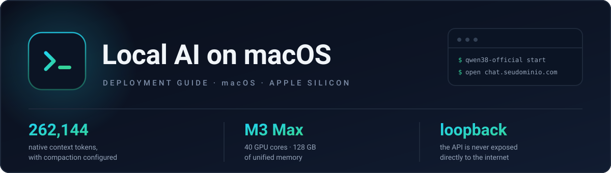

# Local AI on macOS — deployment guide

> **English** · [Português](pt-br/README.md)

**The objective: install, configure and use a local model with Open WebUI on your own Mac.** Nothing
beyond that — no success criterion, no target architecture to reach. The documents cover the whole
path, from the first dependency to daily use.

The rest of the stack is optional: **Cloudflare Tunnel** for phone access and a **browser broker
with human takeover** for automating sites that require a login. Nothing on the main path needs a
VPS — everything runs on one machine.

**This repository is a guide first.** Cloning it is fine, but read it: you execute on your machine
and adapt. The code under `examples/` is the reference implementation of what the documents
describe, not a `docker compose up` turnkey stack.

The model is **not** the point: the guide uses **Qwen3.8-27B** as the worked example, but the stack
is model-agnostic. Swap in whatever you want to test.

---

## Who this is for

**Yes, if you:** have a Mac, are comfortable in a terminal, and want to run models locally and use
them through Open WebUI. Phone access is a bonus, not a requirement.

**No, if you:** want a one-command packaged solution · lack the memory (the measured case uses
**M3 Max, 40 GPU cores, 128 GB**) · would rather use a cloud API.

---

## Conventions: substitute your own values

The documents describe one concrete deployment. These identifiers are **placeholders**:

| Placeholder | What it is |
|---|---|
| `seudominio.com` | Your own domain. Subdomains derive from it: `chat.`, `browser.`, `llm-home.` |
| `admin` | You — the operator. Installs, has root-equivalent access, sees private models |
| `user-a`, `user-b` | Other users. Own login, isolated browser profile, no admin privilege |
| `user-c`, `user-d` | Planned users, no optional container yet |
| `cptr/admin` | Private model ID, in Open WebUI's `prefix/name` format |

Nothing is copy-pasteable literally: generate your own secrets, choose your own domain, create your
own accounts.

---

## The documents

Read in order. 00 and 02 are the path; everything else is context or optional.

| # | Document | What it settles |
|---|---|---|
| 00 | [Architecture and options](docs/00-architecture-and-options.md) | Index. Local-first — the VPS branch is optional |
| 01 | [Case study: local model on M3 Max](docs/01-case-study-qwen38-m3-max.md) | What was measured, with numbers. **Historical record** of one checkpoint |
| 02 | [Deploy on macOS with Cloudflare Tunnel](docs/02-deploy-macos-cloudflare-tunnel.md) | **The main path.** Mac + Tunnel + phone access |
| 03 | [Deploy with a VPS](docs/03-deploy-with-vps.md) | **Optional.** Only if the WebUI must stay up while the Mac is off. Not yet executed |
| 04 | [Browser HITL, multi-user](docs/04-browser-hitl-multi-user-poc.md) | Automating sites with human login and isolated profiles |
| 05 | [Clean-room model install](docs/05-cleanroom-install.md) | Reproducible install, no local re-quantisation |
| 06 | [Adding a second local model](docs/06-second-local-model.md) | A second isolated profile beside the first, without touching it |

**Start with 00.** It sets the local architecture and marks the VPS branch as optional.

### What is validated, and what is not

Honesty over marketing:

| | |
|---|---|
| **Executed and validated** | 02 (main deployment, 256K context, guards, encrypted backup), 04 (local POC and OTP-protected publication), 06 (second profile, end to end) |
| **Not executed** | 03 (VPS runbook) |
| **Structurally validated, not measured** | 05 (bundle and verifiers exercised against a synthetic profile; the real install is still pending) |
| **Known pending items** | post-login physical reboot, external disaster-recovery copy, router confirmation, operational alerts, low-risk mobile E2E |

Every document carries its own status block. None of them hides what is missing.

---

## Examples

Reference code for what the documents describe. Not required in order to follow the guide.

| Directory | What it is |
|---|---|
| [`examples/browser-hitl-poc/`](examples/browser-hitl-poc/) | Multi-user browser broker: persistent profiles, server-side lock, fenced takeover. 8 test files |
| [`examples/qwen38-official-omlx/`](examples/qwen38-official-omlx/) | Model install bundle with pinned revision, hashes, and a verifier |
| [`examples/ornith15-omlx/`](examples/ornith15-omlx/) | Second isolated profile: 9B with Lightning MTP, own port, verifier and wiring script |

---

## Requirements

| | |
|---|---|
| Hardware | Apple Silicon. The measured case uses M3 Max, 40 GPU cores, 128 GB |
| macOS | 13 or later |
| Account | Cloudflare, with a domain you own |
| Knowledge | Terminal, config files, basic networking |

---

## What you end up with

An Open WebUI reachable from your phone at `https://chat.seudominio.com`, serving a local model over
loopback, with its own login, configured context compaction, encrypted backup and autostart — plus a
second hostname, `browser.seudominio.com`, protected by One-Time PIN, for browser automation with
human takeover.

---

## Contributing

See [`CONTRIBUTING.md`](CONTRIBUTING.md). The most valuable contribution is a fix when something
stops working.

---

## License

- **Documentation** (`docs/`, `pt-br/`, this README): [CC BY 4.0](LICENSE) — share and adapt,
  including commercially, with attribution.
- **Code** (`examples/`): [MIT](LICENSE-CODE).

Not an official publication of any vendor. Product names belong to their owners — see
[`NOTICE.md`](NOTICE.md).

---

## Status

A personal deployment, documented between **August and September 2026**. The versions quoted in the
documents are the ones actually used and measured; they age, and each document says what to
re-validate.