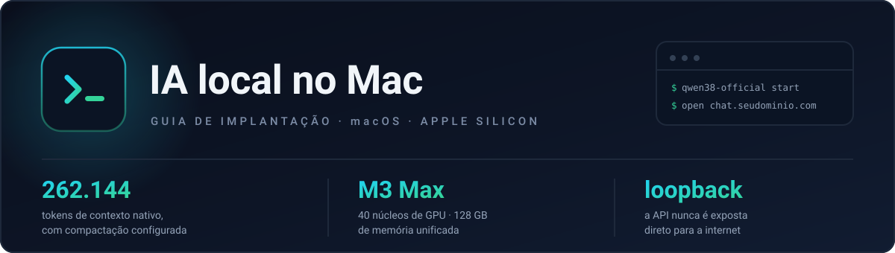

# IA local no Mac — guia de implantação

> [English](../README.md) · **Português**

**O objetivo: instalar, configurar e usar um modelo local com o Open WebUI no seu próprio Mac.**
Nada além disso — sem critério de sucesso, sem arquitetura-alvo a atingir. Os documentos cobrem o
caminho inteiro, da primeira dependência ao uso diário.

O resto da stack é opcional: **Cloudflare Tunnel** para acesso pelo celular e um **broker de
navegador com takeover humano** para automação de sites que exigem login. Nada no caminho principal
precisa de VPS — tudo roda em uma máquina.

**Este repositório é um guia em primeiro lugar.** Clonar é permitido, mas leia: você executa na sua
máquina e adapta. O código em `examples/` é a implementação de referência do que os documentos
descrevem, não uma stack pronta de `docker compose up`.

Os documentos estão em **português**. O código e os comentários, em inglês.

---

## Para quem é

**Sim, se você:** tem um Mac, sabe abrir o terminal e quer rodar modelos localmente e usá-los pelo
Open WebUI. Acesso pelo celular é um bônus, não um requisito.

**Não, se você:** quer uma solução empacotada de um comando só · não tem hardware com memória
suficiente (o caso medido usa **M3 Max, 40 núcleos de GPU, 128 GB**) · prefere uma API na nuvem.

---

## Convenções: substitua pelos seus valores

Os documentos descrevem uma implantação concreta. Estes identificadores são **placeholders**:

| Placeholder | O que é |
|---|---|
| `seudominio.com` | Seu domínio. Os subdomínios derivam dele: `chat.`, `browser.`, `llm-home.` |
| `admin` | Você — o operador. Instala, tem acesso root-equivalente, enxerga modelos privados |
| `user-a`, `user-b` | Demais usuários. Login próprio, perfil de navegador isolado, sem privilégio admin |
| `user-c`, `user-d` | Usuários previstos, ainda sem container opcional |
| `cptr/admin` | ID de modelo privado, no formato `prefixo/nome` do Open WebUI |

Nada é copiável literalmente: gere os seus segredos, escolha o seu domínio, crie as suas contas.

---

## Os documentos

Leia na ordem. 00 e 02 são o caminho; o resto é contexto ou opcional.

| # | Documento | O que resolve |
|---|---|---|
| 00 | [Arquitetura e opções](docs/00-architecture-and-options.md) | Índice. Local-first — o ramo com VPS é opcional |
| 01 | [Estudo de caso: Qwen3.8-27B no M3 Max](docs/01-case-study-qwen38-m3-max.md) | O que foi medido, com números. **Registro histórico** de um checkpoint específico |
| 02 | [Open WebUI sem VPS](docs/02-deploy-macos-cloudflare-tunnel.md) | **O caminho principal.** Mac + Tunnel + acesso pelo celular |
| 03 | [Open WebUI com VPS](docs/03-deploy-with-vps.md) | **Opcional.** Só se o WebUI precisar ficar no ar com o Mac desligado. Ainda não executado |
| 04 | [Browser HITL multiusuário](docs/04-browser-hitl-multi-user-poc.md) | Automação de sites com login humano e perfis isolados |
| 05 | [Qwen3.8 derivado do oficial — clean-room](docs/05-cleanroom-install.md) | Instalação reproduzível, sem requantizar |

**Comece pelo 00.** Ele fixa a arquitetura local e marca o ramo com VPS como opcional.

### O que está validado e o que não está

Honestidade importa mais que marketing:

| | |
|---|---|
| **Executado e validado** | 02 (implantação principal, 256K, guards, backup cifrado), 04 (POC local e publicação com OTP) |
| **Não executado** | 03 (runbook de VPS) |
| **Estruturalmente validado, sem medição** | 05 (bundle e verificadores exercitados em perfil sintético; falta a instalação real) |
| **Pendências conhecidas** | reboot físico pós-login, cópia de disaster recovery externa, confirmação de roteador, alertas operacionais, E2E móvel de baixo risco |

Cada documento traz seu próprio bloco de status. Nenhum deles esconde o que falta.

---

## Exemplos

Código de referência do que os documentos descrevem. Não é necessário para seguir o guia.

| Diretório | O que é |
|---|---|
| [`examples/browser-hitl-poc/`](examples/browser-hitl-poc/) | Broker multiusuário de navegador: perfis persistentes, lock server-side, takeover fenced. 8 arquivos de teste |
| [`examples/qwen38-official-omlx/`](examples/qwen38-official-omlx/) | Bundle de instalação do modelo, com revisão fixada, hashes e verificador |

---

## Requisitos

| | |
|---|---|
| Hardware | Apple Silicon. O caso medido usa M3 Max 40 núcleos / 128 GB |
| macOS | 13 ou superior |
| Conta | Cloudflare com um domínio próprio |
| Conhecimento | Terminal, arquivos de configuração, noções de rede |

---

## O que você vai ter no fim

Um Open WebUI acessível pelo celular em `https://chat.seudominio.com`, servindo um modelo local por
loopback, com login próprio, compactação de contexto configurada, backup cifrado e autostart —
e um segundo hostname, `browser.seudominio.com`, protegido por One-Time PIN, para automação de
navegador com takeover humano.

---

## Contribuindo

Veja [`CONTRIBUTING.md`](../CONTRIBUTING.md). A contribuição mais valiosa é uma correção quando algo
para de funcionar.

---

## Licença

- **Documentação** (`docs/`, este README): [CC BY 4.0](../LICENSE) — compartilhe e adapte, inclusive
  comercialmente, com atribuição.
- **Código** (`examples/`): [MIT](../LICENSE-CODE).

Não é publicação oficial de nenhum fornecedor. Nomes de produtos pertencem aos seus donos — veja
[`NOTICE.md`](NOTICE.md).

---

## Status deste repositório

Implantação pessoal documentada em **agosto e setembro de 2026**. As versões citadas nos documentos
são as que foram efetivamente usadas e medidas; elas envelhecem, e cada documento diz o que
revalidar.